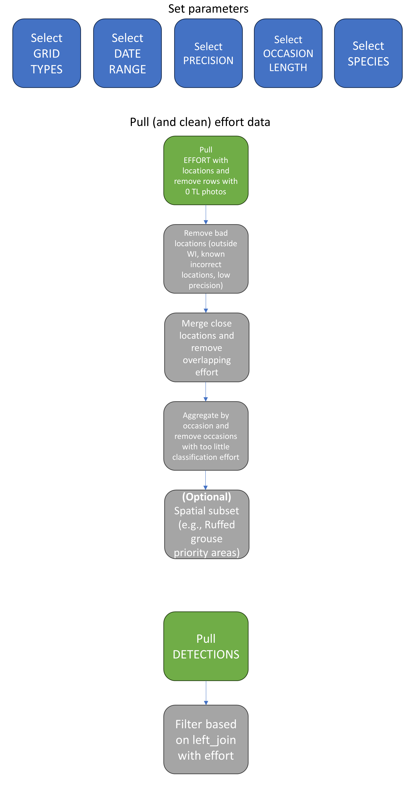

# Background and setup

`sswids` builds on the `sswidb` package (thanks Ryan!) and provides a set of functions for the Snapshot Wisconsin Decision Support Team to query, clean, and format Snapshot Wisconsin data in a standardized way for our team's analyses and products. This tutorial walks through setting up the `sswids` package, querying the raw data, cleaning it, and generating encounter histories.


## Installation

Many of the functions in the `sswids` package are wrappers for Ryan's `sswidb` functions, so we first need to install `sswidb`. `sswidb` needs to be installed from the most recent `.tar.gz` file located [here](//central/OAS/Snapshot/SnapshotRpackage/sswidb/in_dev). You can either set the path to the `sswidb` file yourself, or use `file_choose()` inside of `install.packages()` to navigate to it.

```{r install1, eval = FALSE}
install.packages(file.choose(), source = TRUE, repos = NULL)
```
\

Then `sswids` can be installed from the GitHub repository (R will likely ask for you to install or update several dependencies).

```{r install2, eval = FALSE}
devtools::install_github("SnapshotWisconsin/sswids")
```
\

Check package versions of `sswidb` and `sswids`.

```{r package_versions, message=FALSE,warning=FALSE}

packageVersion("sswidb")
packageVersion("sswids")

```
\

Once the necessary R packages are installed, we can load `sswidb` and `sswids`. We also need to load the `tidyverse` and `sf` packages to help with data cleaning and spatial operations.

```{r libraries, eval = TRUE, message=FALSE}
library(sswidb)
library(sswids)
library(sf)
library(mapview)
library(dplyr)
library(tidyr)
library(readr)
library(png)
select <- dplyr::select

sswids::connect_to_sswidb(db_version = 'PROD')
detections_demo <- readRDS("./data_demo/detections_demo.rds")
locationeffort_demo <- readRDS("./data_demo/locationeffort_demo.rds")
detections_wide_df_maxcountdemo <- readRDS("./data_demo/detections_wide_df_maxcountdemo.rds")
detections_wide_df_counttriggersdemo <- readRDS("./data_demo/detections_wide_df_counttriggersdemo.rds")
effort_by_occ_demo <- readRDS("./data_demo/effort_by_occ_demo.rds")

```
\

## Data workflow graphic

This graphic shows the basic Snapshot Wisconsin Decision Support workflow that we detail in this document.



```{r flow, eval=FALSE, echo=FALSE, fig.align = 'center', out.width='70%'}
knitr::include_graphics(here::here("data_demo/NewDataWorkflow.jpg"))
```

## Connecting to Snapshot Wisconsin database

`sswids` includes a function to set your Snapshot Wisconsin data base credentials once, then automatically access the data base in subsequent sessions using the `connect_to_sswidb` function (rather than storing the `.yaml` credentials file locally on your machine). If you're trying to connect for the first time you can store your credentials with `establish_sswidb_credentials`. You should see three windows pop up to enter the dsn, uid, and pwd from the `.yaml` file, which are then stored in your machine's keychain.

You also have the option of connecting to the 'production' (PROD) data base, or the 'testing' (UAT) data base. Each of these requires a different set of credentials to connect to them.

```{r credentials, eval = FALSE}
# store sswidb credentials; only need to do this once
sswids::establish_sswidb_credentials(db_version = 'PROD')
```
\

Once your credentials are saved in the keychain, you can skip the step above and just connect directly to either the PROD or UAT data base. In most instances we'll be using the PROD data base.

Finally, you can set up folders in your project directory with `setup_project` to store raw data, cleaned data, model outputs, data checks, etc. This will create 3 folders: `data_clean`, `data_raw`, and `output`.

```{r connect, eval = FALSE}
# connect to data base
sswids::connect_to_sswidb(db_version = 'PROD')

# create project folders
sswids::setup_project()
```
\

## Set data parameters

Now that the R packages are installed and loaded, we need to set several parameters for querying, cleaning, and formatting the data. `sswids` is set up to query data within a 'season', or within date ranges across multiple years (e.g., querying data in August of each year to calculate turkey reproductive metrics). `sswids` includes a helper function, `create_season_dates` to do this for you automatically as long as you provide the following information:

- **Start/end year** - Years to query across (these can be the same if you'd like to look at a single year). `create_season_dates` uses `seq` internally to create vector of years. There is an optional argument to get discontinuous 
years of data (e.g. c(2019, 2021, 2023)) but this must be supplied in this manner and with discontinuous=TRUE

- **Start/end date** - Season start and end date. Date ranges must be entered in -MM-DD format

`create_season_dates` (and the subsequent workflow) can handle instances where a season spans two calendar years (i.e., querying data in winter months). For example, if a season is defined as the months of December and January, then the 2018 season includes December of 2018 and January of 2019. Start/end dates can also be set to the first and last day of the year to query data across every day for a range of years.

Date time quality control (DTQC) has been run for SSWI data back to 2018-01-01. Therefore, be cautious with querying for data prior to the start of 2018 as there may be more date time issues. 

In this example, we define our season as September 1 - October 31, and we'd like to query data from each season in 2018, 2019, 2020, 2021, 2022, and 2023:

```{r season, eval = TRUE}


# create data frame of seasons for data filtering
# season start/end dates (in -MM-DD format)
seasons_df <-
  sswids::create_season_dates(
    min_date = "-06-05",
    max_date = "-07-02",
    years = c(2019,2022)
  )

# check out these dates
sswids::check_season_dates(seasons_df)
```
The resulting data frame has 3 columns with the first indicating the season ID and the 2nd and 3rd having start and end dates within a season. `check_season_dates` is a handy function for viewing this table with the added column of season_length_days which can help set the number of occasions in a season later.
\

Next, we need to decide which species and grid types we'd like to include. The `sswidb` package has functions for printing a table to display codes for each of these.

Species:
\

```{r species, eval = FALSE}
# check sswidb species names
sswidb_species(conn)
```

```{r species_tbl, echo = FALSE}
# check sswidb species names
sswidb_species(conn) %>%
  kableExtra::kbl() %>%
  kableExtra::kable_styling(bootstrap_options = c("striped", "hover")) %>%
  kableExtra::scroll_box(width = "100%", height = "300px")
```
\

Grid:
\

```{r grid, eval = FALSE}
# check sswidb grid types
sswidb_grid_types(conn)
```

```{r grid_tbl, echo = FALSE}
# check sswidb grid types
sswidb_grid_types(conn) %>%
  kableExtra::kbl() %>%
  kableExtra::kable_styling(bootstrap_options = c("striped", "hover"))
```
\

We can then set one or more species and grid types. We'll look at deer within the SSWI and Elk grids here. Choose a less abundant species, shorter time frame, or select counties to run this query more quickly. 

```{r species_grid_set, eval = FALSE}
# set species and grid types
species <- c('Bear')
grid <- c('SSWI')
```
\

At this point we should also set a few other variables that are needed for querying the raw data or cleaning/formatting the data in later steps:

- **Classification precision** - this number determines whether certain volunteer detections are returned or not based on the Zooniverse/MySnapshot accuracy levels. It had been standard to use 0.95 so that only classifications where the lower 95% credible interval is above 0.95 are returned. However, it is difficult to assess the effect of a certain precision threshold unless all classifications are included at this level. Therefore, use `prec = 0` to include all classifications.

- **Camera distance** - if cameras are within this distance (in meters) they are merged and considered the same camera site. Use `cam_distance = 100` to merge camera locations that are within 100 m of each other.

- **Coordinate precision** - number of digits after the decimal place of the latitude/longitude coordinates. Use `coord_prec = 4` to include all locations where the location is precise to within 11 m (4 decimal places) of the coordinates. Since summer 2023, any new camera locations require at least 4 decimal places so this filter is only for locations that were entered prior to that date.

- **Number of sampling occasions** - number of sampling occasions used when building encounter histories. To get most granular data (i.e., by day), use the number of sampling occasions equal to the number of days in the sampling season. However, this gets tricky when sampling February over multiple years because of leap year. For this example, use `num_occasions = 10`, though this does not divide evenly for our season which is 61 days. 


```{r other_params}
# set classification precision level
prec <- 0

# set distance (meters) between camera_location_seq_nos to merge/average locations
cam_distance <- 100

# set precision of lat/long coordinates (how many decimal places are needed?)
coord_prec <- 4


```
\
## Query raw effort and location data

Now that all of our data parameters have been set, we can query the necessary raw data from the Snapshot Wisconsin data base using `sswids::query_effort()`. The resulting object, `locationeffort`, contains a nested data frame. With the camera site level information listed across the first 6 columns and the daily effort data contained in the nested column "effort". The effort data comes from the DS_LOCATION_EFFORT table in the database, which gives the daily classification effort for each camera location sequence number. More specifically it has columns for the number of motion trigger photos, time lapse photos, and classified photos from that day. There are 2 possible columns describing the number of classified photos based on 2 different classification definitions. Class_effort_trigger_count shows the number of photos that have been classified by a human observer either through My Snapshot, Zooniverse or Expert queue. Class_final_trigger_count shows the number of photos that have been classified through My Snapshot, Zooniverse, or expert queue ONLY if those classifications meet an accuracy threshold, illustrated in a table displayed by `sswidb::sswidb_species_precision()`.The column included in the effort data pull is automatically chosen for you by specifying the prec argument. The prec argument represent classification precision, the meaning of which is explained above.
As a check on the data, the remove0Timelapse argument defaults to true removing days of effort data if no time lapse photo was taken that day. Snapshot cameras are programmed to take 1 time lapse photo every day and the absence of this photo may indicate a problem with the camera settings.

```{r raw_query, eval = FALSE}
# query effort and location data
locationeffort <-
  sswids::query_effort(conn = conn, prec = prec, grid = grid, daterange = seasons_df, remove0Timelapse = TRUE)

```

```{r viewloceffort, include=FALSE}
head(locationeffort_demo)
head(locationeffort_demo[[7]][[1]]) #View nested effort data for camera
```

# Data cleaning

## Remove detections without Wisconsin location data

Until summer 2023, there was no requirement for the number of decimal places when recording latitude or longitude coordinates, nor the ability to record trailing zeros in the database. Therefore, to ensure precise location data, we remove `camera_location_seq_nos` that have less than 4 decimal places for the latitude and the longitude.

Additionally, there is 1 location that falls in the UP of Michigan and one erroneous location that falls in the middle of a lake which are removed if included in the data pull. 

```{r rm_noloc_data, eval=FALSE}
locationeffort2 <- sswids::rm_bad_locations(locationeffort = locationeffort, coordinate_precision = coord_prec)
```

## Merge close locations

Often, volunteers will maintain a camera then move it to another location very close by, and it may be advantageous later on to combine these locations into a single camera site. `merge_nearby_cameras()` does this for us and creates a new camera location variable called `cam_site_id` that can contain one or more nearby `camera_location_seq_nos`.

Up to this point, locations are kept track of using `camera_location_seq_no`. The `camera_location_seq_no` does not indicate a unique camera location. When there is a new camera deployed or a deployment event created, even at the exact same coordinates, a new `camera_location_seq_no` is created. Also, there are cases when a new camera is deployed, sometimes at the exact same spot, but there are new coordinates associated with that deployment. This step merges the `camera_location_seq_nos` within 100 m of each other together as the same `cam_site_id`. 

For example, `camera_location_seq_no` 66022 and `camera_location_seq_no` 84181 are in very close proximity to one another. To determine whether they should be combined into a single site, we buffer each `camera_location_seq_no` (by `cam_distance` / 2), then--if they touch--we dissolve the buffers into a single buffer. Each buffer is given a `cam_site_id`, and `camera_location_seq_no` 66022 and 84181 share one in this case (cam_0364 in season 4) as they are <100 meters apart:
```{r buffer_map, echo = FALSE, message = FALSE, warning = FALSE, fig.height=7, fig.width=5, fig.align = 'center'}

buffer_demo_sf <- 
  locationeffort_demo %>% 
  dplyr::select(-dnr_grid_id) %>% 
  filter(camera_location_seq_no %in% c(66022, 84181))%>%
  sf::st_as_sf(coords = c("longitude", "latitude"), crs = 4326) %>% 
  sf::st_transform(., 3071)

buffers_sf <- 
  buffer_demo_sf %>% 
  sf::st_buffer(dist = cam_distance/2) %>%
  ungroup()

buffers_union_sf <- 
  sf::st_cast(sf::st_union(buffers_sf), "POLYGON") %>% 
  sf::st_as_sf() %>% 
  dplyr::rename(geometry = x) %>% 
  dplyr::mutate(cam_site_id = dplyr::row_number())

buffer_map <- 
  buffers_union_sf %>%
  #filter(buffer_id == 2630) %>%
  #filter(buffer_id == 847) %>%
  mutate(cam_site_id=replace(cam_site_id, cam_site_id==1,'cam_0364 4')) %>%
  mapview::mapview(layer.name = 'cam_site_id')

cam_map <- 
  buffer_demo_sf %>%select(-effort)%>%
  mutate(camera_location_seq_no = as.factor(camera_location_seq_no)) %>%
  mapview::mapview(layer.name = 'camera_location_seq_no', zcol = 'camera_location_seq_no')

buffer_map + cam_map
```

A `camera_location_seq_no` is buffered and given a new ID (`cam_site_id`) regardless of whether there is a camera nearby or not. In some cases, multiple `camera_location_seq_nos` may be in the same exact location (for example, a camera is deployed and later replaced with a different camera).

The lat/long for `cam_site_id` are created later once effort is finalized and transformed to daily effort for the purposes of creating a weighted average location.

The lat lon for cam_site_id are created after weighting the location for cam_site_id by effort at each camera location sequence number. This function also: removes cam_site_ids with overlapping effort of more than 1 day, and removes some columns to tidy up data frame (grid type, grid id, lat/long coordinates associated
with camera location sequence number).

This step also finds errors in the database and removes them. There is potentially more manual work that could be done to 'save' some effort. But, these fixes are manual and complicated with no clear blanket solution. For now, the best decision is to detect and remove site-years with overlapping effort. 

Overlapping effort can happen when a batch is associated with the wrong camera location. In these cases there may be batches that have the same `cam_site_id` and start and end active dates that overlap. Another common reason for overlapping effort is if the camera has been programmed with the wrong date. Even just 1 day different can result in batches with the same `cam_site_id` and overlapping start and end active dates. 

Batches at the same `cam_site_id` and year (site-year) are assessed for overlap in their start and end active dates. If overlap is detected, all the data for that site-year is removed. If there is no overlap detection at that `cam_site_id` over the other years, then those data are retained.
```{r merge_nearby_cameras, eval=FALSE}
locationeffort3 <- merge_nearby_cameras(locationeffort = locationeffort2, cam_distance = cam_distance)
```

## Pull in detection data
Now that we've filtered our location/effort data down to information that is a little more reliable, we can start thinking about matching it up with detection data. This first requires that we pull in the detection data which we do so here using `query_detections()` which calls `sswidb::sswidb_detections()` internally and iteratively for each season. The prec argument relates to the classification percision and controls what data is pulled in. It should be set to 0 or 0.95 and match the prec argument for `query_effort`.

```{r detections pull, eval=FALSE}
detections <- query_detections(conn = conn, species = "Bear", grid = "SSWI", daterange = seasons_df, prec = 0)
```

## Create sampling occasions

Next, we group the effort data into occasions based on the number of occasions. We calculate the number of days active for each cam_site_id, season, and occasion. If there was no effort, the days active is entered as 0. This is also where the proportion of classified photos by occasion is calculated and then filtered. The class_threshold allows you to specify this threshold of classification effort an ddefaults to 0.95.


```{r sampling_occasions, eval=FALSE}
#summarize effort by sampling occasions make prop_classified column
locationeffort4 <-create_sampling_occasions(daterange = seasons_df, locationeffort = locationeffort3, num_occasions = 4, class_threshold =  0.95)

```
\

Ideally, the number of days in the season divides evenly into the number of occasions. If not, then the additional sampling days are distributed starting at the first occasion. The `sswids::create_sampling_occasions` function uses `dplyr::ntile`. Here is an example of how `ntile` allocates the additional day to different occasions by year within our function. 

```{r ntile_example, echo=FALSE,message=FALSE,warning=FALSE}

# create data frame of seasons for data filtering
# season start/end dates (in -MM-DD format)
seasons_df2 <-
  sswids::create_season_dates(
    min_date = "-06-05",
    max_date = "-07-04",
    years = c(2019,2022)
  )

# check out these dates
sswids::check_season_dates(seasons_df2)

num_occasions <- 4

day_occasion_df_table <- seasons_df2 %>% dplyr::group_by(season) %>% 
    tidyr::nest() %>% dplyr::mutate(date = purrr::map(data, 
    date_sequence)) %>% tidyr::unnest(date) %>% dplyr::select(-data) %>% 
    dplyr::mutate(day_of_season = dplyr::row_number()) %>% 
    dplyr::mutate(occ = dplyr::ntile(day_of_season, 
    num_occasions)) %>%
  group_by(season,occ) %>%
  count() %>%
  pivot_wider(names_from=occ,values_from=n)

day_occasion_df_table %>%
  kableExtra::kbl(caption="Number of days by year and occasion") %>%
  kableExtra::kable_styling(bootstrap_options = c("striped", "hover"))

```
\

Here are the first 1000 rows of `effort_by_occ_df`:

```{r effort_by_occ_demo, echo=FALSE,message=FALSE,warning=FALSE}

effort_by_occ_demo[1:1000,1:4] %>%
  kableExtra::kbl(caption="Number of days by year and occasion") %>%
  kableExtra::kable_styling(bootstrap_options = c("striped", "hover")) %>%
  kableExtra::scroll_box(width = "100%", height = "300px")

```
\

## Create detection histories and join detections with effort

Now the effort data is summarized by `cam_site_id-year-occasions`. We summarize the detection data in this same way, by `cam_site_id-year-occasions`. Upon discretizing detections into occasions, we can join our detection and effort data, removing detections with no or insufficient effort associated with that cam_site x occasion x year.

There are various ways we can do this.  For example, for `DEER_ADULT_ANTLERLESS_AMT`, the total triggers for cam_0001 in 2019 occasion 1 is 7. In this row of data there were 7 triggers that were classified as `DEER_ADULT_ANTLERLESS_AMT`. This structuring of the data makes the total counts of `CLASS_KEYS` more comparable to raw data. But is also possible to obtain the maximum count of every `CLASS_KEY` per `cam_site_id-year-occasion`.  For example, for `DEER_ADULT_ANTLERLESS_AMT`, the max count for cam_0001 in 2019 occasion 1 is 1. The max count is 0 if there are any days of effort but 0 detections. The max count is NA if there are 0 days active. 

Getting either a total number of triggers or max count per `cam_site_id-year-occasions` is done by specifying the `summary_value` argument of the `sswids::summarize_detections` function to either `"count triggers"` or `"max count"`. The default is total number of triggers or `count triggers` of every `CLASS_KEY` per `cam_site_id-year-occasion`.


```{r detection_histories, eval=FALSE}

#the max count across detections within a sampling occasion
detections_wide_df_maxcount <- summarize_detections(detections = detections, locationeffort = locationeffort4, summary_value = "max count")


# the sum of triggers with spp present within a sampling occasion

detections_wide_df_counttriggers <- summarize_detections(detections = detections, locationeffort = locationeffort4, summary_value = "count triggers")

```
\

Here are the first 1000 rows of `detections_wide_df_maxcount`:

```{r det_maxcount_tab, echo=FALSE,message=FALSE,warning=FALSE}

detections_wide_df_maxcountdemo[1:1000,] %>%
  kableExtra::kbl() %>%
  kableExtra::kable_styling(bootstrap_options = c("striped", "hover")) %>%
  kableExtra::scroll_box(width = "100%", height = "300px")

```
\

Here are the first 1000 rows of `detections_wide_df_counttriggers`:

```{r det_counttrigs_tab, echo=FALSE,message=FALSE,warning=FALSE}

detections_wide_df_counttriggersdemo[1:1000,] %>%
  kableExtra::kbl() %>%
  kableExtra::kable_styling(bootstrap_options = c("striped", "hover")) %>%
  kableExtra::scroll_box(width = "100%", height = "300px")

```
\
## Join to spatial information

In a final step, we join the  count triggers and max counts `cam_site_id-year-occasion` data frame to the spatial data we want. 


```{r final_data, message=FALSE}

# merge spatial information with effort wide form
detections_wide_df_maxcountdemo_sf = detections_wide_df_maxcountdemo %>%
  sf::st_as_sf(coords=c("lon", "lat"), crs=4326)%>%
  sf::st_join(
    .,
    sf::st_transform(get_spatial_data("bear_zones"), 4326),
    join = sf::st_within
  )

detections_wide_df_counttriggersdemo_sf = detections_wide_df_counttriggersdemo %>%
  sf::st_as_sf(coords=c("lon", "lat"), crs=4326)%>%
  sf::st_join(
    .,
    sf::st_transform(get_spatial_data("bear_zones"), 4326),
    join = sf::st_within
  )
```

```{r, eval=FALSE}
# save effort join files
write_rds(effort_by_occ_df_maxcount_join,"data_clean/effort_by_occ_df_maxcount_join.Rds")
write_rds(effort_by_occ_df_counttriggers_join,"data_clean/effort_by_occ_df_counttriggers_join.Rds")
```


\

Here are the first 1000 rows of `effort_by_occ_df_maxcount`:

```{r eff_maxcount_tab, echo=FALSE,message=FALSE,warning=FALSE}

detections_wide_df_maxcountdemo_sf[1:1000,] %>%
  kableExtra::kbl() %>%
  kableExtra::kable_styling(bootstrap_options = c("striped", "hover")) %>%
  kableExtra::scroll_box(width = "100%", height = "300px")

```
\

Here are the first 1000 rows of `effort_by_occ_df_counttriggers`:

```{r eff_counttrigs_tab, echo=FALSE,message=FALSE,warning=FALSE}

detections_wide_df_counttriggersdemo_sf[1:1000,] %>%
  kableExtra::kbl() %>%
  kableExtra::kable_styling(bootstrap_options = c("striped", "hover")) %>%
  kableExtra::scroll_box(width = "100%", height = "300px")

```
\
\
